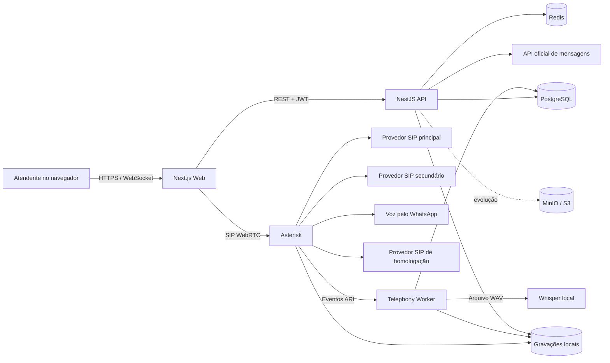

# Omni Platform

Plataforma interna de atendimento omnichannel com WhatsApp, telefonia SIP,
gravações e transcrição de chamadas.

## 1. Visão geral

O **Omni Platform** é uma aplicação interna para centralizar o atendimento por
WhatsApp e telefonia. O foco atual é permitir que vendedores e atendentes façam
e recebam chamadas por ramais individuais, enquanto supervisores e
administradores acompanham a operação, escutam gravações e consultam
transcrições.

Diretório local esperado para desenvolvimento:

```text
{{diretorio_local}}\omni-platform
```

## 2. Estado atual

### Implementado

- Autenticação com perfis e permissões.
- Caixa de entrada para conversas do WhatsApp.
- Janela de atendimento de 24 horas da API oficial de mensagens.
- Painel de telefonia.
- Discador WebRTC com teclado, DTMF, mudo e espera.
- Agenda de contatos com clique para ligar.
- Campanhas de discagem progressiva com distribuição de um contato por vez.
- Registro de resultado e observações por contato da campanha.
- Ramais WebRTC individuais no navegador.
- Ligações telefônicas por troncos SIP configuráveis.
- Estrutura SIP para chamadas de voz do WhatsApp.
- Recebimento autenticado e idempotente de eventos de voz pelo WhatsApp.
- Monitoramento de conexão e restrições temporárias da conta de voz.
- Histórico de ligações com filtros por dia, colaborador, canal e status.
- Gravação automática das chamadas atendidas.
- Reprodução protegida das gravações pela API.
- Transcrição local com `faster-whisper`.
- Alternativa de transcrição pela OpenAI.
- Retentativas automáticas de transcrição.
- Painel administrativo diário.
- Dashboard consolidado com período, direção, colaborador, canal e status.
- Cards de volume, falhas, conclusões e tempos de conversação.
- Série temporal por hora, dia, semana e mês, separando entrada e saída.
- Tabela detalhada com reprodução, transcrição e exportação CSV.
- Cadastro, ativação e desativação de colaboradores.
- Atribuição automática de ramais.
- Separação de acesso entre administrador, supervisor e atendente.
- Isolamento de organizações no PostgreSQL com Row Level Security.

### Validado localmente

- Autenticação e separação de acesso entre administrador e atendente.
- Atendente limitado ao próprio ramal, chamadas, gravações e transcrições.
- Bloqueio HTTP `403` para atendente no dashboard e na gestão de colaboradores.
- Dashboard administrativo em desktop e viewport móvel de 390 px.
- Migrações, Row Level Security, lint, typecheck, testes e build completo.
- Registro dos troncos existentes no Asterisk local.
- Discagem WebRTC, eventos ARI, persistência, gravação e transcrição local.
- Dialplan com início, atendimento e encerramento reais da chamada.
- Webhook de voz com token, deduplicação e roteamento por organização.

### Pendente ou parcialmente validado

- Fazer novos testes reais de entrada e saída para cada tronco contratado.
- Configurar uma URL HTTPS temporária para receber eventos externos no ambiente
  local; nenhum túnel está ativo por padrão.
- Correlacionar deterministicamente o ID externo da chamada com o ID do Asterisk
  antes de importar gravações mantidas pelo provedor.
- Registrar o encerramento do pós-atendimento; enquanto o campo não existir, a
  interface exibe `Não disponível`.
- Migrar gravações para armazenamento em objeto e definir retenção e descarte.
- Implementar auditoria de reprodução/download, backup externo, monitoramento e
  testes de chamadas simultâneas.

Não existe ambiente online ativo. A versão mais avançada e a fonte de verdade
estão no repositório e no ambiente local. Nenhum deploy em nuvem faz parte do
fluxo atual.

O histórico da infraestrutura que já foi removida está preservado, apenas para
auditoria, em [`docs/URGENTES-OPERACAO.md`](docs/URGENTES-OPERACAO.md).

A arquitetura, a operação local e o checklist específico do discador estão em
[`docs/DISCADOR.md`](docs/DISCADOR.md).

O escopo consolidado do dashboard, do discador, das integrações SIP, das
validações e das pendências desta entrega está em
[`docs/ENTREGA-TELEFONIA-2026-08-13.md`](docs/ENTREGA-TELEFONIA-2026-08-13.md).

A configuração e os limites da voz pelo WhatsApp estão em
[`docs/VOZ-WHATSAPP-LOCAL.md`](docs/VOZ-WHATSAPP-LOCAL.md).

O plano de evolução que mantém as regras de negócio no Omni e limita a
plataforma telefônica externa a um adaptador substituível está no prompt mestre
[`docs/PROMPT-EVOLUCAO-INDEPENDENTE-TELEFONIA.md`](docs/PROMPT-EVOLUCAO-INDEPENDENTE-TELEFONIA.md).

## 3. Arquitetura



### Componentes

| Componente | Tecnologia | Responsabilidade |
|---|---|---|
| `apps/web` | Next.js 15, React 19, SIP.js | Interface, sessão e telefone WebRTC |
| `apps/api` | NestJS 11 | Autenticação, conversas, telefonia e controle de acesso |
| `apps/telephony-worker` | Node.js, WebSocket ARI | Eventos de chamadas, gravações e transcrições |
| `packages/db` | Drizzle ORM, PostgreSQL | Schema, migrações e isolamento multiempresa |
| `packages/auth` | JWT, Argon2 | Senhas, tokens, perfis e permissões |
| `packages/config` | Zod | Validação das variáveis de ambiente |
| `packages/observability` | Logs estruturados | Logs com ocultação de dados sensíveis |
| `packages/provider-contracts` | TypeScript | Contratos para SIP, WhatsApp, storage e transcrição |
| `infra/asterisk` | Asterisk 20 | PBX, ramais, filas, troncos e gravação |
| `infra/whisper` | Python, faster-whisper | Transcrição local de áudio |
| `infra/docker-compose.yml` | Docker Compose | PostgreSQL, Redis, MinIO, Asterisk e Whisper |

## 4. Estrutura do repositório

```text
omni-platform/
├── apps/
│   ├── api/
│   ├── telephony-worker/
│   ├── web/
│   └── workers/
├── infra/
│   ├── asterisk/
│   ├── whisper/
│   └── docker-compose.yml
├── packages/
│   ├── auth/
│   ├── config/
│   ├── db/
│   ├── eslint-config/
│   ├── observability/
│   ├── provider-contracts/
│   ├── queue-kit/
│   ├── testing/
│   └── tsconfig/
├── .env.example
├── package.json
├── pnpm-workspace.yaml
└── turbo.json
```

## 5. Requisitos para desenvolvimento

- Windows 10 ou 11.
- Docker Desktop.
- Node.js 20 ou superior.
- pnpm 11.18 ou compatível.
- Git.
- Microfone e permissão de áudio no navegador.
- Credenciais de um provedor SIP para testes reais.

## 6. Instalação local

### 6.1 Instalar dependências

```powershell
cd {{diretorio_local}}\omni-platform
pnpm install
```

### 6.2 Criar o arquivo de ambiente

```powershell
Copy-Item .env.example .env
```

Preencha o `.env` local. Nunca publique esse arquivo e nunca copie senhas para
documentação, issues ou commits.

As principais categorias são:

- API, Web e URLs locais.
- PostgreSQL e role restrita da aplicação.
- Redis.
- MinIO/S3.
- segredos JWT.
- Asterisk ARI e WebRTC.
- provedores SIP de telefonia.
- provedor de voz pelo WhatsApp.
- API oficial de mensagens do WhatsApp.
- Whisper local ou OpenAI.

### 6.3 Subir a infraestrutura

```powershell
docker compose --env-file .env -f infra/docker-compose.yml up -d --build
```

### 6.4 Carregar o `.env` no PowerShell

Os comandos do banco leem variáveis do processo. No terminal de
desenvolvimento, carregue o arquivo sem imprimi-lo:

```powershell
Get-Content .env | ForEach-Object {
  if ($_ -match '^\s*([^#][^=]*)=(.*)$') {
    [Environment]::SetEnvironmentVariable(
      $matches[1].Trim(),
      $matches[2].Trim().Trim('"'),
      'Process'
    )
  }
}
```

### 6.5 Preparar o banco

```powershell
pnpm --filter @omni/db db:setup
```

Esse comando executa migrações, cria a role restrita usada pela aplicação e
sincroniza os perfis e permissões.

### 6.6 Criar a primeira organização e o administrador

```powershell
pnpm --filter @omni/db db:create-org "Minha Empresa" minha-empresa "Administrador" admin@empresa.com "uma-senha-temporaria-segura"
```

A senha precisa ter pelo menos 12 caracteres. Como o valor entra no histórico
do terminal, utilize uma senha temporária e faça a troca conforme a política da
empresa.

### 6.7 Iniciar a aplicação

```powershell
pnpm dev
```

## 7. Endereços locais

| Serviço | Endereço padrão |
|---|---|
| Aplicação Web | `http://localhost:3000` |
| API | `http://localhost:3001` |
| Saúde da API | `http://localhost:3001/health` |
| Prontidão da API | `http://localhost:3001/ready` |
| Asterisk ARI | `http://127.0.0.1:8088/ari` |
| Asterisk WebSocket | `ws://localhost:8088/ws` |
| Whisper | `http://127.0.0.1:8090` |
| MinIO API | `http://localhost:9000` |
| MinIO Console | `http://localhost:9001` |
| PostgreSQL | `localhost:5432` |
| Redis | `localhost:6379` |

## 8. Telas do produto

| Rota | Função |
|---|---|
| `/login` | Autenticação |
| `/inbox` | Conversas e mensagens do WhatsApp |
| `/telefonia` | Estado dos troncos, ramal, equipe e discador |
| `/telefonia/ligacoes` | Histórico filtrado de ligações |
| `/telefonia/gravacoes` | Áudios e transcrições |
| `/telefonia/admin` | Gestão diária e colaboradores; somente administrador |

## 9. Perfis e visibilidade

### Administrador

- Visualiza toda a organização.
- Gerencia colaboradores e ramais.
- Consulta ligações, gravações e transcrições da equipe.
- Acessa o painel administrativo.

### Supervisor

- Visualiza os resultados da equipe.
- Consulta ligações e transcrições.
- Escuta e pode baixar gravações conforme a permissão atribuída.
- Não cadastra usuários pelo painel administrativo atual.

### Atendente

- Faz e recebe chamadas pelo próprio ramal.
- Visualiza somente suas ligações.
- Escuta somente suas gravações.
- Visualiza somente suas transcrições.
- Não visualiza outros atendentes.

### Auditor

- Possui acesso de leitura aos dados autorizados.
- Não altera contatos, conversas, canais ou usuários.

O escopo do atendente é aplicado na API, não apenas escondido na interface.

## 10. Telefonia

### 10.1 Ramais

O intervalo padrão é de `1001` a `1099`, totalizando até 99 ramais cadastrados.
O limite real de chamadas simultâneas depende do contrato do provedor, da CPU,
da rede, dos codecs e do dimensionamento do Asterisk.

O administrador pode informar um ramal de quatro dígitos ou deixar a plataforma
selecionar automaticamente o próximo ramal livre.

### 10.2 Ligações de saída

1. O usuário autentica seu ramal SIP.js no Asterisk por WebSocket.
2. O navegador envia a chamada para o Asterisk.
3. O dialplan seleciona o tronco SIP conforme o canal escolhido.
4. O Asterisk inicia a gravação quando a chamada é atendida.
5. Eventos personalizados são enviados pelo ARI.
6. O worker persiste a chamada e agenda a transcrição.

### 10.3 Ligações recebidas

1. O provedor envia o `INVITE` SIP ao Asterisk.
2. O Asterisk encaminha para a fila configurada, por padrão `vendas`.
3. A estratégia padrão é `rrmemory`.
4. O ramal que atende é associado ao colaborador correspondente.
5. O áudio é gravado e processado após o encerramento.

Para receber chamadas em uma máquina atrás de NAT, normalmente são necessários:

- IPv4 público, túnel compatível ou infraestrutura acessível pelo provedor.
- UDP `5060` para sinalização SIP.
- UDP `10000–10099` para RTP.
- firewall restrito aos IPs do provedor sempre que possível.
- SIP ALG desabilitado quando causar registro instável ou áudio unilateral.

O ambiente atual hospeda o Asterisk somente na máquina local. ICE/STUN, RTP
simétrico e `rtp_keepalive` estão configurados, mas chamadas recebidas a partir
da internet dependem de conectividade externa controlada. Redes corporativas
mais restritivas ainda podem exigir um servidor TURN.

### 10.4 Provedores

**Provedor SIP principal:** telefonia fixa e móvel por tronco autenticado. A
entrada pelo DID ainda precisa de uma nova validação completa no ambiente local.

**Provedor SIP secundário:** telefonia fixa e móvel por usuário e senha. A rota
usa o prefixo interno `*7`, removido antes de enviar o número brasileiro no
formato `55...`. As credenciais ficam exclusivamente no `.env`.

**Provedor de voz pelo WhatsApp:** apresenta as chamadas ao Asterisk como outro
tronco SIP. É independente da integração de mensagens. A API recebe eventos de
chamada, gravação e dispositivo com token e idempotência, mas não cria chamadas
sintéticas quando o provedor omite horários ou identificadores correlacionáveis.

**Provedor SIP de homologação:** usa autenticação por lista de IP, destino E.164
e Caller ID previamente autorizado. O ramal do navegador é preservado antes da
troca do Caller ID para manter a atribuição correta ao colaborador.

**API oficial de mensagens:** recebe e envia mensagens do WhatsApp Business. A
integração de mensagens não substitui o tronco usado para chamadas de voz.

## 11. Gravações e transcrições

O Asterisk utiliza `MixMonitor` para produzir arquivos WAV. Os arquivos ficam
em `infra/.local/asterisk-recordings` no ambiente atual.

O `telephony-worker` acompanha eventos ARI:

- `OmniRecordingStarted`;
- `OmniRecordingFinished`.

Após o término da chamada, o worker:

1. atualiza o histórico da chamada;
2. valida a existência do WAV;
3. registra os metadados da gravação;
4. envia o áudio ao provedor de transcrição;
5. grava texto, idioma, modelo e segmentos no PostgreSQL.

O provedor padrão é `whisper_local`, executado no próprio Docker. Também há
implementações `mock` e `openai`.

As transcrições com falha podem ser tentadas novamente automaticamente, com
espera progressiva, até cinco tentativas. A tela de gravações também oferece
uma ação manual de reprocessamento.

## 12. API principal

### Saúde

- `GET /health`
- `GET /ready`

### Autenticação

- `POST /auth/login`
- `POST /auth/refresh`
- `POST /auth/logout`
- `GET /auth/me`

### Conversas

- `GET /conversations`
- `GET /conversations/:id/messages`
- `POST /conversations/:id/messages`
- `POST /conversations/:id/read`

### Telefonia

- `GET /telephony/overview`
- `GET /telephony/calls`
- `GET /telephony/recordings`
- `GET /telephony/webrtc-config`
- `GET /telephony/recordings/:id/audio`
- `POST /telephony/recordings/:id/retry-transcription`
- `GET /telephony/dialer/contacts`
- `POST /telephony/dialer/contacts`
- `GET /telephony/dialer/campaigns`
- `POST /telephony/dialer/campaigns`
- `PATCH /telephony/dialer/campaigns/:id/status`
- `POST /telephony/dialer/campaigns/:id/next`
- `PATCH /telephony/dialer/items/:id/result`

Filtros disponíveis nas listas: `date`, `userId`, `provider` e `status`.

### Administração de telefonia

- `GET /telephony/admin/daily`
- `GET /telephony/admin/dashboard`
- `GET /telephony/admin/collaborators`
- `POST /telephony/admin/collaborators`
- `PATCH /telephony/admin/collaborators/:id/status`

### WhatsApp

- `GET /webhooks/whatsapp`
- `POST /webhooks/whatsapp`
- `POST /webhooks/whatsapp/voice`
- `GET /whatsapp/voice/status`

## 13. Modelo de dados

As principais tabelas são:

- `organizations`: empresas ou unidades isoladas.
- `users`: usuários globais.
- `organization_users`: vínculo de usuário, organização e perfil.
- `roles`, `permissions`, `role_permissions`: autorização.
- `contacts`, `contact_channels`: clientes e canais.
- `conversations`, `messages`: caixa de entrada.
- `whatsapp_accounts`, `phone_numbers`: configurações de canais.
- `telephony_extensions`: ramais atribuídos.
- `voice_calls`: histórico normalizado de chamadas.
- `call_recordings`: metadados dos áudios.
- `call_transcriptions`: texto, segmentos e retentativas.
- `dialer_campaigns`: campanhas, canal, estado e responsável.
- `dialer_campaign_items`: fila progressiva, atribuição e resultado do contato.
- `audit_logs`: estrutura de auditoria.
- `webhook_deliveries`, `event_outbox`: eventos e processamento confiável.

O áudio não é armazenado dentro do PostgreSQL.

## 14. Comandos de desenvolvimento

```powershell
pnpm dev
pnpm build
pnpm lint
pnpm typecheck
pnpm test
```

Comandos úteis da infraestrutura:

```powershell
docker compose --env-file .env -f infra/docker-compose.yml ps
docker compose --env-file .env -f infra/docker-compose.yml logs -f asterisk
docker compose --env-file .env -f infra/docker-compose.yml logs -f whisper
docker compose --env-file .env -f infra/docker-compose.yml exec asterisk asterisk -rx "pjsip show registrations"
docker compose --env-file .env -f infra/docker-compose.yml exec asterisk asterisk -rx "pjsip show endpoints"
```

## 15. Portas de rede

| Porta | Protocolo | Serviço | Exposição recomendada |
|---|---|---|---|
| 3000 | TCP | Web | Local em desenvolvimento; HTTPS em produção |
| 3001 | TCP | API | Privada ou atrás de proxy HTTPS |
| 5060 | UDP | SIP | Somente provedor e regras específicas |
| 8088 | TCP | ARI/WebSocket | Local no desenvolvimento; proxy TLS em produção |
| 10000–10099 | UDP | RTP | Provedores e clientes de mídia necessários |
| 8090 | TCP | Whisper | Apenas localhost/rede privada |
| 5432 | TCP | PostgreSQL | Apenas rede privada |
| 6379 | TCP | Redis | Apenas rede privada |
| 9000/9001 | TCP | MinIO | Apenas rede privada/administração |

## 16. Segurança e privacidade

- Nunca versionar `.env`, senhas SIP, chaves de provedores ou segredos JWT.
- Trocar qualquer credencial compartilhada por captura de tela ou mensagem.
- Utilizar HTTPS e WSS em produção.
- Restringir ARI, banco, Redis, MinIO e Whisper à rede privada.
- Manter a role administrativa do banco separada da role da aplicação.
- Preservar as políticas RLS de todas as tabelas multiempresa.
- Registrar acesso a áudio e exportações antes do uso em produção.
- Definir retenção, descarte, consentimento e finalidade das gravações conforme
  a política interna e a LGPD.
- Não expor UDP `5060` para toda a internet quando for possível restringir aos
  endereços do provedor.
- Realizar backup criptografado do banco e das gravações.

## 17. Estado de operação

O projeto opera somente no ambiente local. Não existe VPS, instância em nuvem,
domínio de homologação ou aplicação pública ativa associada a esta versão.

Antes de qualquer futura publicação:

1. Obter autorização explícita do responsável pelo projeto.
2. Confirmar orçamento, retenção, backup e restauração.
3. Expor somente HTTPS, SIP restrito e o intervalo RTP indispensável.
4. Manter API, ARI, PostgreSQL, Redis, storage e transcrição em rede privada.
5. Trocar todas as credenciais locais e utilizar um gerenciador de segredos.
6. Testar entrada, saída, áudio, gravação, transcrição e concorrência.
7. Validar LGPD, consentimento e descarte antes do uso com dados reais.

## 18. Diagnóstico rápido

### Tronco não registra

```powershell
docker compose --env-file .env -f infra/docker-compose.yml exec asterisk asterisk -rx "pjsip show registrations"
```

Verifique host, usuário, senha, DNS, horário da máquina e firewall.

### Ramal aparece offline

```powershell
docker compose --env-file .env -f infra/docker-compose.yml exec asterisk asterisk -rx "pjsip show endpoints"
```

Verifique WebSocket, credencial do ramal, permissão do microfone e console do
navegador.

### Ligação recebida cai imediatamente

Ative temporariamente o logger SIP:

```powershell
docker compose --env-file .env -f infra/docker-compose.yml exec asterisk asterisk -rx "pjsip set logger on"
docker compose --env-file .env -f infra/docker-compose.yml logs -f asterisk
```

Se nenhum pacote aparecer, investigue NAT, encaminhamento de UDP, CGNAT,
firewall e roteamento do DID no provedor.

### Existe chamada, mas não há áudio

Verifique o intervalo RTP, endereço externo do Asterisk, NAT, codecs e SIP ALG.

### Gravação não aparece

Verifique:

- logs do Asterisk;
- presença do WAV em `infra/.local/asterisk-recordings`;
- conexão ARI do `telephony-worker`;
- caminho `ASTERISK_RECORDINGS_PATH`;
- permissões do volume.

### Chamada do provedor de homologação aparece como `Não atribuída`

Confirme que a rota correspondente salva `CALLERID(num)` em `OMNI_ORIGIN_EXTENSION`
antes de substituir o Caller ID pelo número verificado. O quinto argumento de
`record-and-dial` deve usar `OMNI_ORIGIN_EXTENSION`. Depois de atualizar o
container Asterisk, faça uma nova chamada: o histórico antigo não é alterado.

### Transcrição falhou

```powershell
docker compose --env-file .env -f infra/docker-compose.yml logs -f whisper
```

Confirme modelo, memória disponível, tamanho do áudio e acesso ao endpoint
local. Depois use a ação de tentar novamente na tela de gravações.

## 19. Próximos passos

O backlog detalhado, a ordem recomendada de implementação e os critérios de
validação estão consolidados no
[`prompt mestre de evolução independente`](docs/PROMPT-EVOLUCAO-INDEPENDENTE-TELEFONIA.md).

1. Configurar o token e testar eventos reais de voz pelo WhatsApp usando um
   túnel HTTPS temporário e restrito.
2. Validar entrada e saída reais nos troncos locais configurados.
3. Registrar o fim do pós-atendimento para calcular `wrap_up_time` e tempo médio
   de atendimento sem estimativas.
4. Correlacionar o ID externo da chamada com o ID do Asterisk.
5. Migrar gravações para armazenamento em objeto.
6. Implementar auditoria de reprodução, download e exportação.
7. Definir retenção, consentimento e descarte das gravações.
8. Adicionar monitoramento, alertas e backup com restauração testada.
9. Criar testes end-to-end do navegador e de chamadas simultâneas.
10. Publicar um runbook de recuperação de incidentes.

## 20. Controle de versão

Os marcos funcionais, correções da telefonia e mudanças operacionais devem ser
registrados em commits separados para permitir auditoria e reversão segura.

O projeto é atualmente uma aplicação interna. Não há licença pública definida;
não assuma permissão de redistribuição sem autorização da empresa.
