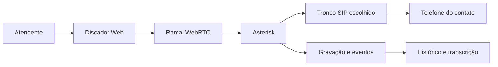

# Discador da Omni Platform

## Objetivo

O discador é a área operacional usada por atendentes para realizar chamadas no
navegador, consultar contatos e trabalhar listas de campanhas. Ele reutiliza o
ramal WebRTC individual já registrado no Asterisk e os troncos SIP configurados
na plataforma.

Nesta fase, toda a implementação e validação devem acontecer no ambiente local.
O deploy para a VPS só deve ser feito depois que migrações, testes, fluxo de
ligação e permissões forem aprovados localmente.

## Escopo implementado

- teclado telefônico com `0–9`, `*` e `#`;
- digitação, correção e preenchimento do número a partir de um contato;
- chamada, atendimento e encerramento pelo ramal WebRTC;
- envio de DTMF durante a chamada;
- ativação e desativação do microfone;
- colocação da chamada em espera e retomada;
- seleção de DirectCall, Twilio ou WaVoIP;
- cadastro e listagem de contatos;
- criação de campanhas por administradores e supervisores;
- ativação, pausa e conclusão de campanhas;
- distribuição progressiva de um contato por vez para cada atendente;
- registro do resultado e das observações do atendimento;
- métricas de total, pendentes, concluídos e falhas;
- isolamento por organização e controle de acesso por perfil.

O acesso web fica em `/telefonia/discador`.

## Funcionamento da discagem



Na discagem manual, o atendente escolhe o canal, informa o número e inicia a
ligação. Na campanha progressiva, a API reserva atomicamente o próximo item
pendente para aquele atendente. O contato permanece atribuído até o resultado
ser salvo, evitando que dois atendentes trabalhem o mesmo item ao mesmo tempo.

## Perfis e permissões

| Ação | Administrador | Supervisor | Atendente |
|---|---:|---:|---:|
| Usar o telefone | Sim | Sim | Sim |
| Consultar contatos | Sim | Sim | Sim |
| Cadastrar contato | Sim | Sim | Sim |
| Solicitar próximo contato | Sim | Sim | Sim |
| Salvar resultado próprio | Sim | Sim | Sim |
| Criar campanha | Sim | Sim | Não |
| Iniciar, pausar ou concluir campanha | Sim | Sim | Não |

As consultas continuam limitadas à organização da sessão por RLS. Um atendente
não recebe permissão administrativa para controlar campanhas ou visualizar
dados de outra organização.

## Modelo de dados

As estruturas são criadas pela migração
`packages/db/migrations/0010_telephony_dialer.sql`:

- `dialer_campaigns`: configuração, canal, estado e responsável pela campanha;
- `dialer_campaign_items`: contatos da fila, atribuição, tentativas e resultado;
- `contacts` e `contact_channels`: cadastro reaproveitado como agenda do
  discador.

As tabelas do discador têm RLS habilitada e forçada, índices para a fila e
chaves estrangeiras para organização, contato e usuário.

## Endpoints

Todos exigem autenticação e contexto de organização:

- `GET /telephony/dialer/contacts`
- `POST /telephony/dialer/contacts`
- `GET /telephony/dialer/campaigns`
- `POST /telephony/dialer/campaigns`
- `PATCH /telephony/dialer/campaigns/:campaignId/status`
- `POST /telephony/dialer/campaigns/:campaignId/next`
- `PATCH /telephony/dialer/items/:itemId/result`

## Execução local

Pré-requisitos: Node.js, pnpm, Docker Desktop, microfone autorizado no navegador
e um `.env` local preenchido sem expor credenciais.

```powershell
cd C:\Users\Criate\Documents\Codex\omni-platform
pnpm install
docker compose --env-file .env -f infra/docker-compose.yml up -d postgres redis asterisk whisper
pnpm --filter @omni/db db:migrate
pnpm dev
```

Depois, abra `http://localhost:3000/telefonia/discador` e faça primeiro um teste
com destino autorizado pelo provedor.

Para validar banco, migração e políticas RLS em uma única execução local, abra
o PowerShell com o mesmo usuário que executa o Docker Desktop e rode:

```powershell
powershell -ExecutionPolicy Bypass -File .\infra\scripts\validate-dialer-local.ps1
```

O script usa `infra/docker-compose.postgres.yml`, sobe somente o serviço
`postgres` e não exige credenciais SIP, não acessa a VPS e não realiza deploy.
Use `-StopPostgresAfter` se quiser desligar o contêiner ao terminar.

### Estado da validação local

Em 13/08/2026, lint, typecheck, build e todos os testes que não dependem do
banco passaram. A migração também possui uma verificação estática para impedir
que as políticas RLS usem uma variável de organização incompatível com a
aplicação.

A validação de integração com PostgreSQL permanece obrigatória. Ela só pode ser
executada depois que o Docker Desktop indicar que o mecanismo está em execução
e a porta local `5432` estiver disponível. Uma falha de conexão nesse ponto é
uma indisponibilidade da infraestrutura local, não autorização para publicar ou
usar o banco da VPS como substituto.

Nenhum deploy deve ser iniciado enquanto essa etapa e o checklist abaixo não
estiverem concluídos.

## Validação antes do deploy

1. Executar a migração em um PostgreSQL local limpo.
2. Executar `pnpm lint`, `pnpm typecheck`, `pnpm test` e `pnpm build`.
3. Criar contatos e uma campanha com perfil administrativo.
4. Confirmar que um atendente não consegue controlar campanhas.
5. Reservar o próximo contato simultaneamente em duas sessões e verificar que
   não ocorre atribuição duplicada.
6. Fazer chamada real em cada provedor habilitado.
7. Testar áudio nos dois sentidos, DTMF, mudo, espera e encerramento.
8. Confirmar histórico, atribuição ao ramal, gravação e transcrição.
9. Verificar que chamadas falhas não geram gravações falsas.
10. Fazer backup e só então preparar o deploy.

## Limitações atuais

- A estratégia implementada é **progressiva**: o atendente solicita o próximo
  contato. Não existe discagem preditiva ou chamadas automáticas simultâneas.
- Transferência assistida ou cega ainda não está implementada. Ela exige validar
  o comportamento SIP, o dialplan e a tarifação de cada provedor.
- O discador não elimina a operadora. Asterisk e a aplicação podem ser próprios,
  mas chamadas para a rede telefônica pública ainda precisam de um tronco SIP,
  DID ou operadora licenciada.
- Limites, destinos, identificação de chamada e custos dependem do contrato com
  DirectCall, Twilio ou WaVoIP.
- Campanhas de chamadas devem respeitar consentimento, bloqueios, horários,
  política interna e requisitos aplicáveis da LGPD.

## Próximas etapas recomendadas

1. Importação de contatos por CSV com pré-visualização e deduplicação.
2. Retorno agendado e fila pessoal de callbacks.
3. Transferência para outro ramal ou fila.
4. Tela de supervisão em tempo real para campanhas.
5. Auditoria de alterações e exportações.
6. Limites de tentativas, janelas de horário e lista de não perturbe.
7. Testes end-to-end e de concorrência antes de qualquer discagem automática.
